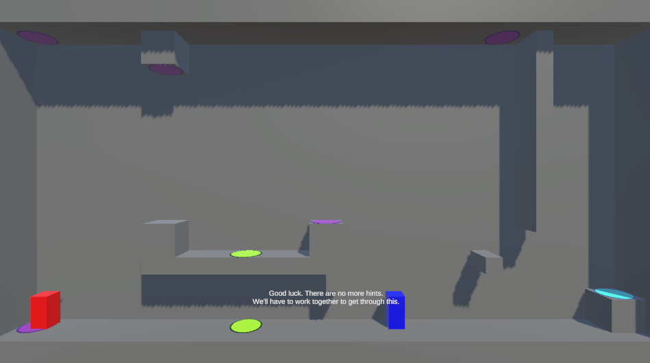

# Development-GravitySwitch

## Preview

---

## Introduction

> Unity 엔진을 사용해 제작한 **3D 기반의 2D 퍼즐 플랫폼 게임**입니다.
> 플레이어는 좌우 이동, 중력 반전 패드, 텔레포트 패드를 이용하여 퍼즐을 해결하며 스테이지를 클리어합니다.

---

## 기술 및 학습 내용

| 구분       | 내용                              |
| -------- | ------------------------------- |
| UI 시스템   | 메인 화면, 레벨 선택, 설정 메뉴 구현 및 화면 전환  |
| 오디오 시스템  | 싱글톤 기반 BGM 매니저, 슬라이더 연동, 볼륨 저장  |
| 세이브 시스템  | JSON 기반의 레벨 클리어 데이터 저장/로드       |
| 플레이어 컨트롤 | Input System을 통한 이동 및 Use 행동 처리 |
| 커스텀 중력   | 중력 방향을 직접 제어하며 물리 이동 구현         |
| 패드 인터랙션  | 중력 반전, 텔레포트, 목표 도착 패드 기능 구현     |
| 씬 흐름 제어  | 레벨 로딩, 다음 스테이지 이동, 메인 메뉴 복귀     |

---

## 개선 아이디어

* 중력 반전 및 텔레포트 시 시각 효과 추가
* 사운드 효과(SFX) 시스템 확장
* 스테이지 클리어 조건 다양화 (타이머, 수집 요소 등)
* 레벨 에디터 개발을 통한 자유도 있는 스테이지 제작
* 모바일 대응 UI 및 조작 방식 확장

---

## Requirements

> 프로젝트 실행 환경 및 버전 정보

| 항목       | 내용                    |
| -------- | --------------------- |
| OS       | Windows 11            |
| Engine   | Unity **6000.0.58f2** |
| Language | C#                    |

---

## Summary

이 프로젝트를 통해 Unity의 입력 시스템, 오브젝트 관리, UI 설계, 오디오 시스템, 세이브 구조, 게임 루프 설계까지 게임 개발에 필요한 핵심 요소들을 종합적으로 학습하였다. 작은 규모의 프로젝트이지만 Prefab 관리, 싱글톤 매니저 구조, 씬 전환 시스템, 커스텀 물리 처리 등을 직접 구현하며 실제 게임 개발 과정의 전반적인 흐름을 경험할 수 있었다.

특히 패드 기반의 퍼즐 구조를 만들며 상호작용 시스템 설계, 중력 방향 제어를 통한 커스텀 물리 시스템 구현, UI와 데이터 저장을 연결하는 게임 진행 구조화까지 다양한 실습을 수행하였다.

이번 프로젝트는 Unity를 활용한 게임 제작의 기본기를 탄탄히 다지는 데 큰 도움이 되었으며, 향후 더 복잡한 게임 시스템을 설계할 수 있는 기반을 마련하는 경험이 되었다.
